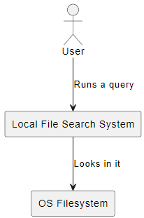
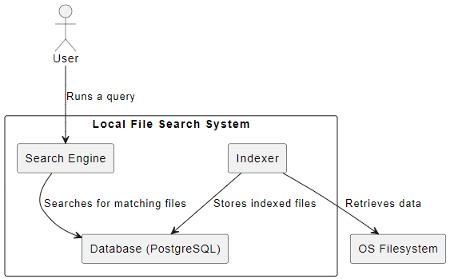
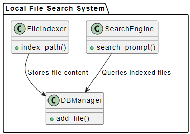

# Diagrams

## 1. System Context Diagram

### Explanation

* We have a single actor, being a generic user, not authorization/authentication is done, who will interact with a "search engine" which will in turn interact with the filesystem of the OS it will run on.

## 2. Containers diagram

### Explanation

* Starting from the right side, we have the indexer which will do the "heavy lifting" of handling the files (both get from OS and put in DB).
* I've chosen PostgreSQL mainly because you can't go wrong with it if you have enough time to get it working. I was tempted to use MongoDB just for the hell of learning something new, but I've stuck with ol' reliable for now.
* The search engine will send prompts to the DB and return the results (in a pretty way) to the user.

## 3. Components diagram

### Explanation

* This is the diagram I'm most doubtful about. I don't know what to say except that the names chosen portrait their use in quite an efficient way.
