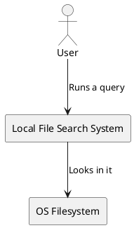
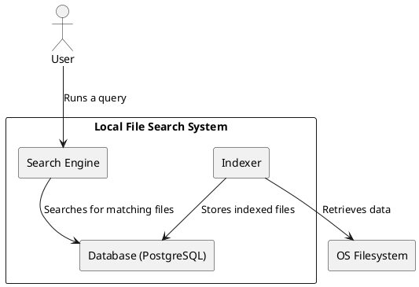
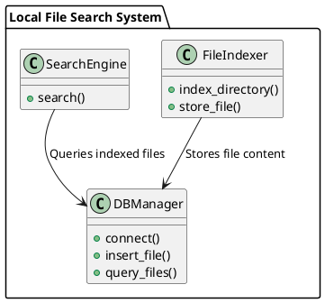

# Diagrams

## 1. System Context Diagram

## 2. Containers diagram

## 3. Components diagram

*Personal notes here:*

1. The database will be hosted remotely on my work PC. Local IP: 192.168.83.202:5432
   1. TODO: OPEN PORT 5432

Development notes: to be deleted or moved

* What do I need for a search engine?
  * I need an indexer (crawl local data, filter, STORE IN DB)
  * I need a database (postgres)
  * I need something to actually search in the database based on the user queries
* Who uses this?
  * Just me, a regular user
* What does it access?
  * Just the local filesystem. No data of needing anything else. (should think of the future somehow...)
*
